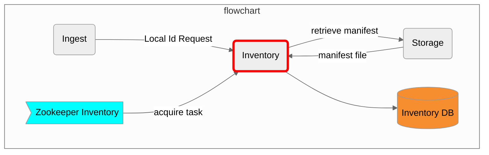

# Merritt Inventory Service

This microservice is part of the [Merritt Preservation System](https://github.com/CDLUC3/mrt-doc).

## Purpose

This microservice records information about new files and new objects that have been ingested into the Merritt Preservation System.
Information is recorded into the Merritt Inventory Database (MySQL).

The work performed by this service is driven from a Zookeeper Queue.  
This service also provides an API to resolve local identifiers submitted with Merritt content.

## Original System Specifications
- [Merritt Inventory Service](https://github.com/CDLUC3/mrt-doc/blob/main/doc/Merritt-inventory-latest.pdf)

## Component Diagram

## Dependencies

This code depends on the following Merritt Libraries.
- [Merritt Core Library](https://github.com/CDLUC3/mrt-core2)
- [CDL Zookeeper Library](https://github.com/CDLUC3/cdl-zk-queue)
- [Merritt Inventory Zookeeper Library](https://github.com/CDLUC3/mrt-zoo)

## For external audiences
This code is not intended to be run apart from the Merritt Preservation System.

See [Merritt Docker](https://github.com/CDLUC3/merritt-docker) for a description of how to build a test instnce of Merritt.

## Build instructions
This code is deployed as a war file. The war file is built on a Jenkins server.

## Test instructions

## Internal Links

### Deployment and Operations at CDL

https://github.com/CDLUC3/mrt-doc-private/blob/main/uc3-mrt-inventory.md
